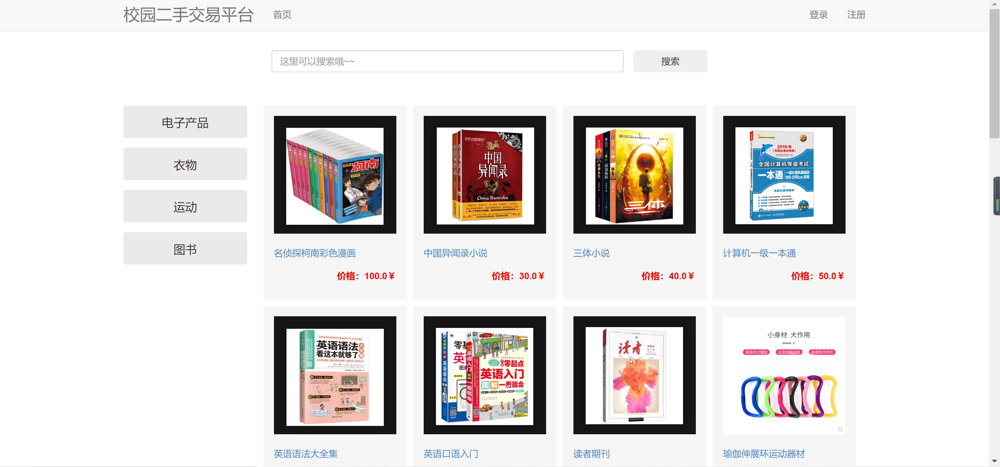
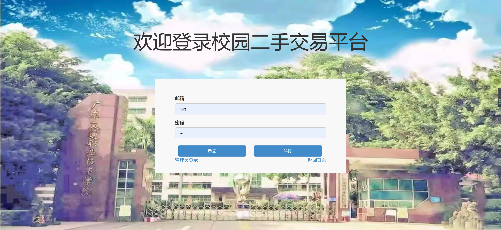
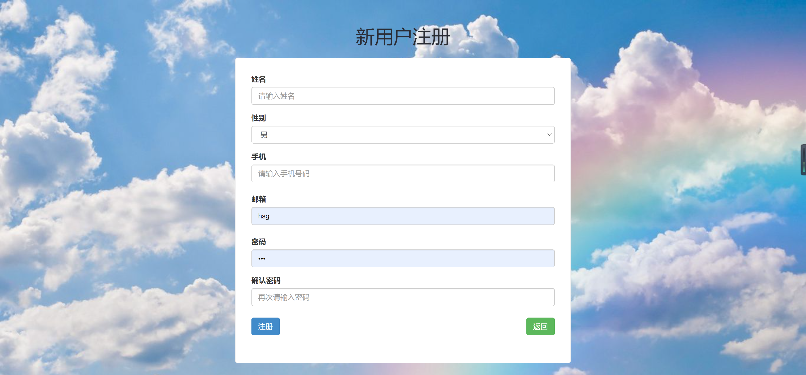
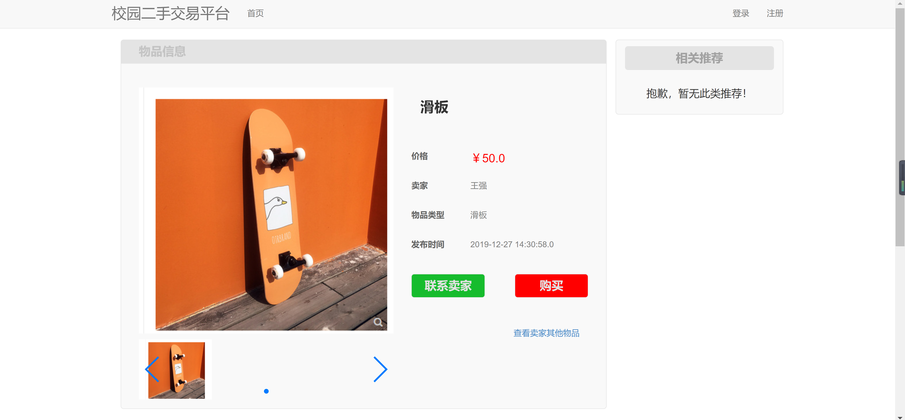
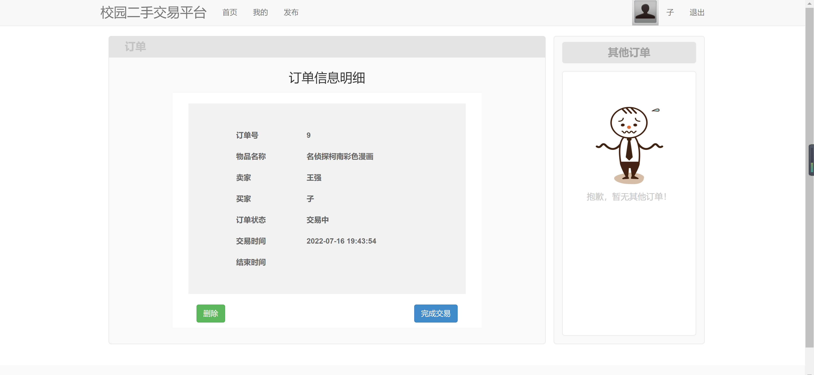
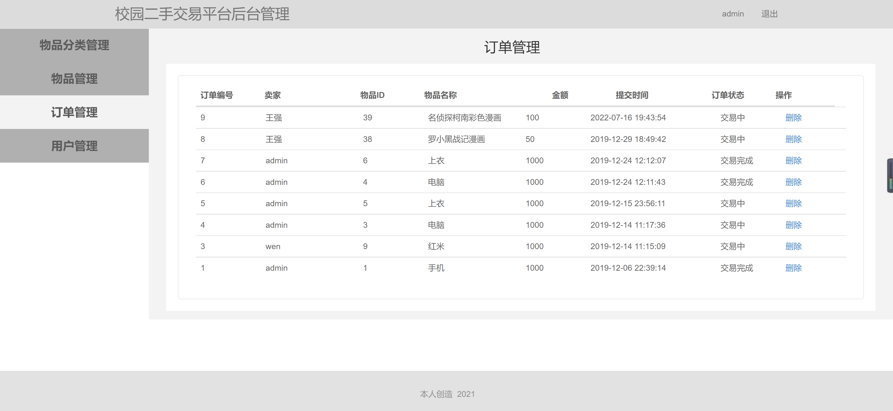
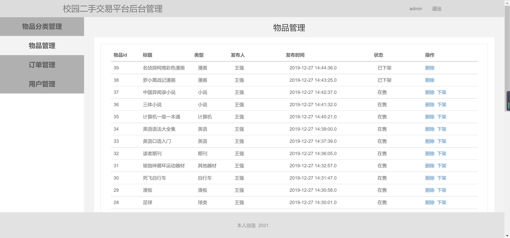

<h1 align="center">校园二手交易平台系统</h1>

## 简介
校园二手交易平台系统：角色分为管理员、用户；功能包括商品浏览、物品管理、订单管理和用户管理，支持商品搜索与分类查看，简化用户注册和登录流程，便于安全交易。    --计算机毕业设计源码；毕设源码；java毕业设计源码

## 联系方式

<h3 align="center">获取完整代码与数据库文件 + 微信：bysj5151 QQ: 86050149 QQ群: 783742310</h3>

<h3 align="center">可帮忙远程部署 包运行成功！提供远程部署、修改代码、设计文档指导、代码讲解等服务！</h3>

## 功能介绍（完整见运行截图）
管理员： 管理员可以通过后台管理系统执行多项管理任务，包括物品分类、物品管理、订单跟踪与管理、以及用户管理。他们能够查看和处理订单状态，如交易中或已完成，并有权限删除订单。管理员还可以管理商品的上架与下架状态，确保平台的商品信息保持最新。  
用户： 用户能够在平台上浏览和寻找自己感兴趣的二手商品。通过一个简洁明了的界面，用户可以查看商品详情、联系卖家或直接购买商品。注册和登录功能简化了访问权限的管理，注册过程中需提供基本的个人信息。平台还具备搜索功能和分类浏览，以帮助用户快速找到所需物品。

## 运行截图

本代码来源于网络,仅供学习参考使用!

